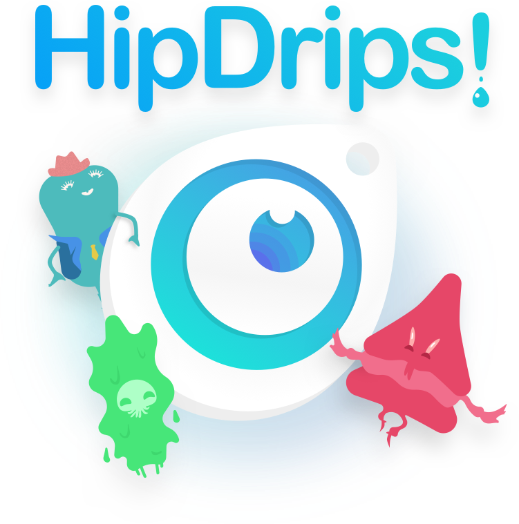

# HipDrips! 👩‍🎨👨‍🎨
### The Fun & Simple Way to Snag a Little Color

<center>
  
</center>

## Leave HipDrip in Your Dock for Quick Access
  

## Or Quickly Use Spotlight
  

## HipDrip Opens with a Random Color Every Time
  

## Who the- 
  


## ✨ How To Install ✨ 
``` 
- download the .zip of this repo
- unzip
- drag HipDrips.app to your Applications folder
- update your security settings to open a new Application
- Drip! 🎨
```