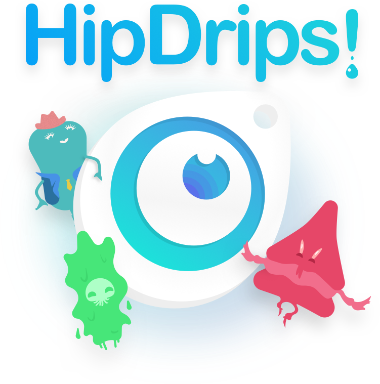
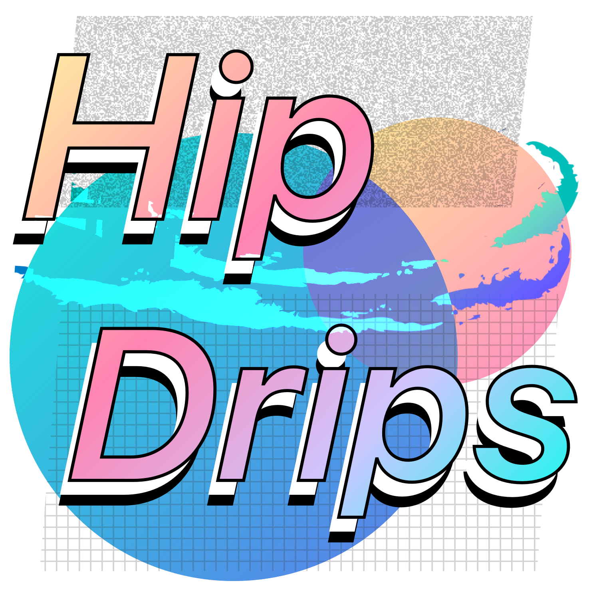
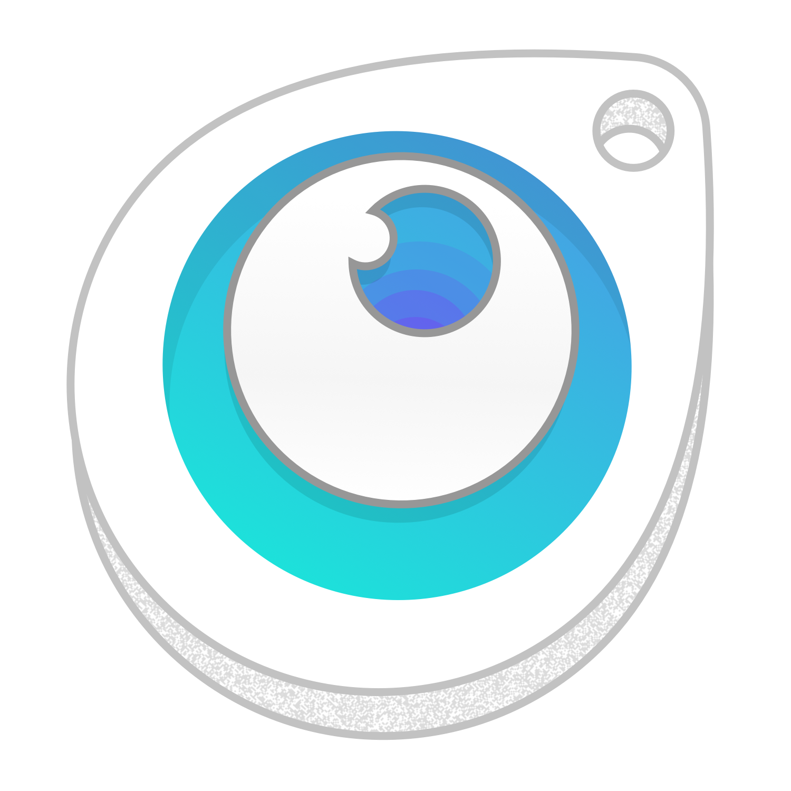
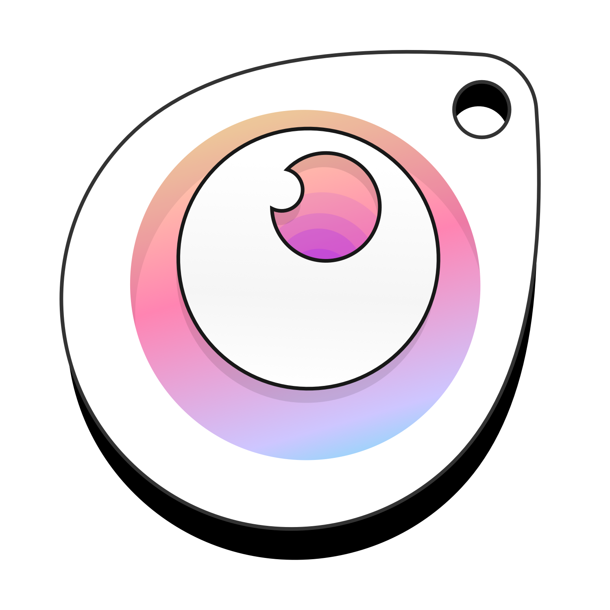

## Leave HipDrip in Your Dock for Quick Access
  

## Or Quickly Use Spotlight
  

## HipDrip Opens with a Random Color Every Time
  

## Who the- 
  


## ✨ How To Install ✨ 
``` 
- download the .zip of this repo
- unzip
- drag HipDrips.app to your Applications folder
- update your security settings to open a new Application
- Drip! 🎨
```

## Bonus
Included in this repo is a collection of alternate icons. Honestly, I've spent more time brainstorming the branding than actually building this app. SO go ahead and toss em in. 

1. `open` alternate icon image > `Cmd + C` to copy
2. `right-click` HipDrips.app > Get Info > `click` on the icon image in the top left > `Cmd + D` to paste
3. Presto!






