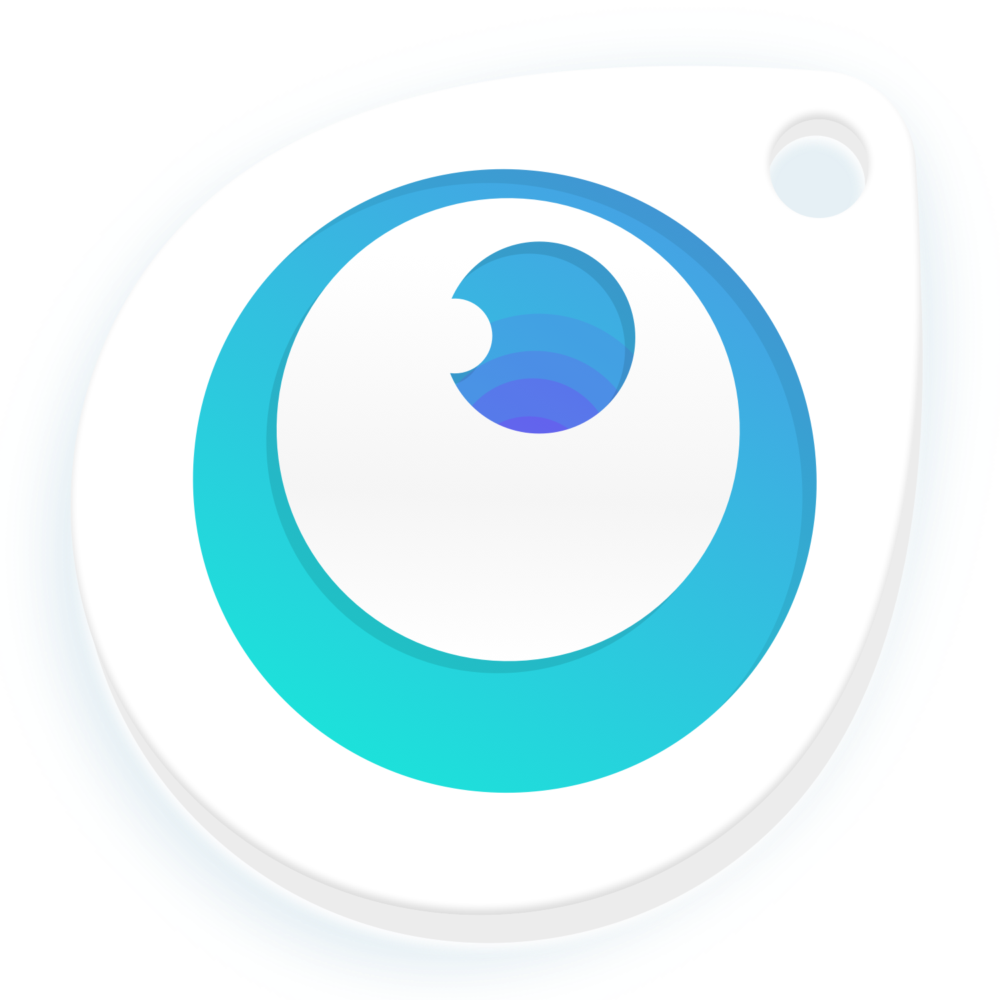

## Leave HipDrip in Your Dock for Quick Access
  

## Or Quickly Use Spotlight
  

## HipDrip Opens with a Random Color Every Time
  

## Who the- 
  

# How to Get Started
- Download the latest release from this projects <a href="https://github.com/andrewmundy/hipdrip/releases">Releases</a> page
- download, unzip, and drag HipDrips.app to your Applications folder
- update your security settings to open a this Application being that this was "Downloaded from the web"
- Get Drippin! 🎨

# ✨Bonus Alternative Icons!✨ 😱👩‍🎨🍾

I take my icons seriously. I keep only a few applications in my dock so I prefer to maintain optimal bottom screen fung shui. Because of this I am providing a few variations just incase you have similar preferences. Honestly, I've spent more time brainstorming the imagery than actually building this app. SO go ahead and toss em in!

### How to Do
1. click one of the images below
2. `right-click` and `Copy Image`
2. `right-click` HipDrips.app > Get Info > `click` on the icon image in the top left > `cmd + v` to paste
3. Presto!

